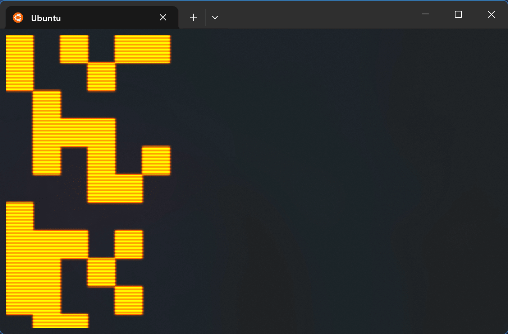
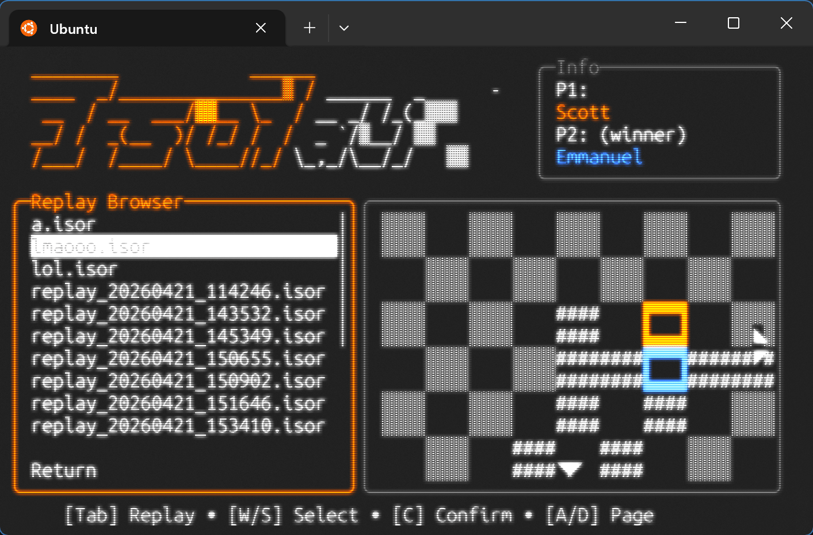
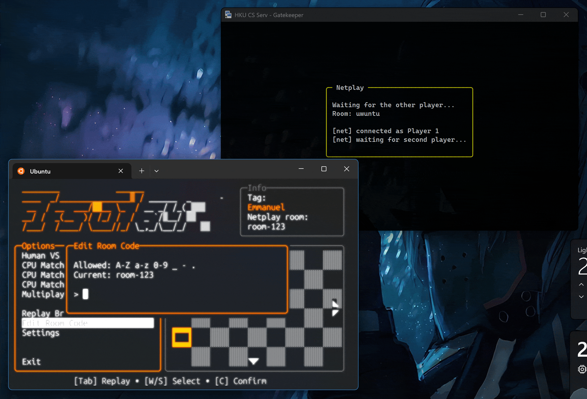
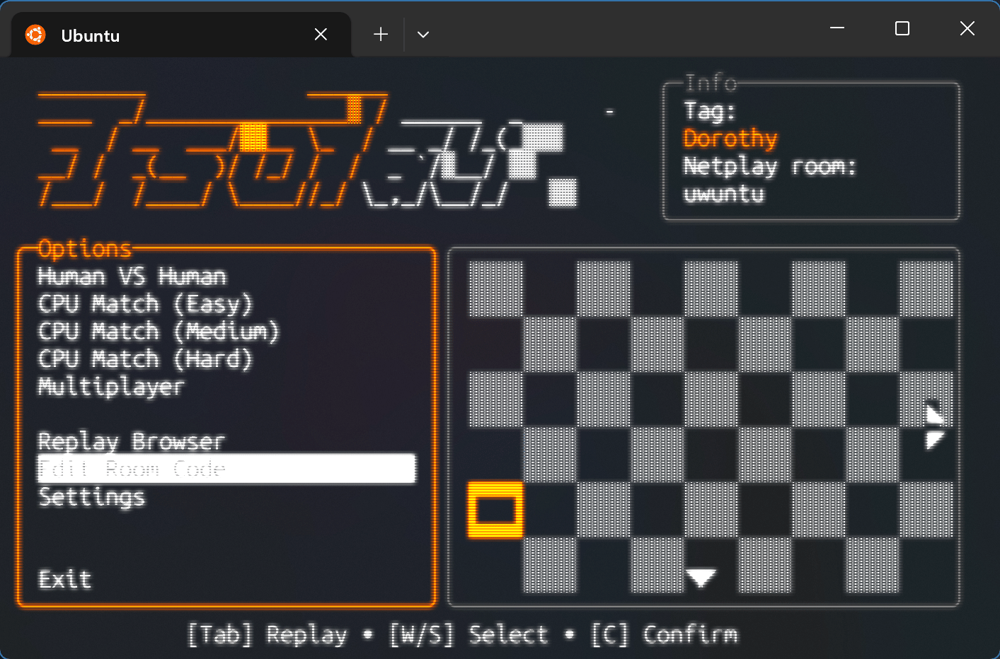

# Isolation Chess

A terminal-based C++ implementation of Isolation Chess with local play, three AI difficulty levels, replay save/load, a replay browser, and simple two-player netplay.



## Team members (in alphabetical order)

- Cecilia
- Emmanuel: initial concept, core architecture design, code integration among members, UI layer & netplay implementation.
- Gino
- Haneef
- Noah
- Scott: Implemented GameRules module and related core tests. Implemented the replay saving/reading part. Recorded and edited the project demo video.

## Application description

Isolation Chess is a terminal-based C++ strategy game built with ncurses. The project supports local multiplayer, single-player matches against AI, replay saving/loading, a replay browser, and lightweight two-player netplay through a Python relay server.

## Reference

Original concept reference: <https://scratch.mit.edu/projects/241565591/>

## Features

- **Local multiplayer**: Human vs Human
- **Single-player**: Human vs CPU with **Easy**, **Medium**, and **Hard** AI
  - 

- **Replay system**:
  - save finished or in-progress games from the HUD command box
  - load replays from the built-in replay browser
  - replay stepping, reset, and autoplay
  - replay files also preserve player names and stored UI messages
  
  
- **Netplay**:
  - room-based two-player connection through a lightweight Python relay server
  - player tags exchanged during handshake
  - in-game chat through the HUD command box
  

- **Settings editor** from the launcher:
  - server IP
  - server port
  - local player tag
  

- **Dynamic ncurses layout**:
  - board and HUD relayout on terminal resize
  - board scrolling when the viewport is smaller than the full board
  

- **Colorized HUD log messages** for player actions, help output, replay saves, and network status

## What the current launcher does

The main entry point is `src/main.cpp`. The launcher currently supports:

1. Human vs Human
2. Human vs CPU - Easy
3. Human vs CPU - Medium
4. Human vs CPU - Hard
5. Netplay
6. Replay browser
7. Edit settings
8. Edit room code
0. Exit

The main runtime path uses:

- `include/scenes/live_match_scene.hpp`
- `include/scenes/netplay_scene.hpp`
- `include/scenes/replay_scene.hpp`
- `include/scenes/replay_browser.hpp`
- `src/main.cpp`

## Controls

## Launcher menus

The launcher and browser menus are currently digit-driven.

- `1`-`8` select menu items
- `0` exits from the main launcher
- replay browser uses:
  - `1`-`7` open visible replay entries
  - `8` return
  - `9` previous page
  - `0` next page

## Live match controls

When the **game board is focused**:

- `WASD` move the selection cursor
- `Enter` / `C` confirm move or break
- `X` cancel selection and snap cursor back to the active piece
- `Q` is not the main quit path here; use HUD commands instead

When the **HUD is focused**:

- `Tab` or `Esc` switches focus between board and HUD
- `Up` / `Down` scroll the log
- `Left` / `Right` move the command cursor
- `Backspace` deletes in the command box
- `Enter` submits a command or chat message

### Live match HUD commands

Supported shared commands in local play and netplay:

- `:h` or `:help` — show command help
- `:save [name]` — save a replay into `./replays`
- `:quit [name]` — save a replay, then leave the match
- `:quit!` — leave without saving

Replay names are restricted to letters, digits, `_`, `-`, and `.`.

## Replay controls

When the **replay board is focused**:

- `A` step backward
- `D` step forward
- `Space` toggle autoplay
- `R` reset replay to the beginning
- `Q` leave replay mode
- `Tab` or `Esc` switches focus between board and HUD

When the **HUD is focused**, the command box accepts:

- `:q` or `:quit` — leave replay mode
- `:reset` — reset replay
- `:play` — toggle autoplay
- `:back` — step backward
- `:forward` — step forward

## Netplay

Netplay is built around a simple room relay server in `server/relay_server.py`.

### Wire protocol summary

Client messages:

- `JOIN <room> <tag>`
- `MOVE <turn> <row> <col>`
- `BREAK <turn> <row> <col>`
- `CHAT <text>`

Server messages:

- `WELCOME <1|2>`
- `WAITING`
- `START <p1_tag> <p2_tag>`
- `MOVE <turn> <row> <col>`
- `BREAK <turn> <row> <col>`
- `CHAT <1|2> <text>`
- `INFO <free text>`
- `ERROR <free text>`

### Start the bundled relay server

```bash
python3 server/relay_server.py
```

The bundled server listens on:

- host: `0.0.0.0`
- port: `5050`

### Important settings note

The default `Settings` in `include/misc/settings_io.hpp` currently use:

- `serverIp = "localhost"`
- `serverPort = 5050`
- `gameTag = "Player"`

So if you use the bundled relay server without editing anything else, the bundled relay server and default settings already match on port `5050`.

## Replay files

Replay files are written into the `replays/` directory using the `.isor` extension.

If no filename is provided, the game generates a timestamped replay name such as:

```text
replay_YYYYMMDD_HHMMSS.isor
```

If a chosen filename already exists, the replay system appends `_1`, `_2`, and so on instead of overwriting the old file.

Stored replay data currently includes:

- initial board state
- board size
- player starting positions
- side/phase/status metadata
- winner
- player names
- full turn history
- stored UI messages

## AI overview

The AI implementation lives in `include/players/ai_player.hpp` and `src/players/ai_player.cpp`.

Current strategy mix:

- **Easy**: mostly random, sometimes greedy, rarely minimax
- **Medium**: balanced random/greedy/minimax mix, with more minimax as turns progress
- **Hard**: mostly minimax, and fully minimax in tighter endgames

The AI also includes:

- non-blocking think delays based on the game tick rate
- greedy move selection
- minimax with alpha-beta pruning
- stronger endgame behavior when the board becomes sparse

## Project layout

This is the current layout that matters for the active launcher path.

```text
.
├─ include/
│  ├─ core/
│  ├─ misc/
│  ├─ players/
│  ├─ scenes/
│  ├─ sessions/
│  └─ ui/
├─ src/
│  ├─ core/
│  ├─ misc/
│  ├─ players/
│  ├─ sessions/
│  ├─ ui/
│  └─ main.cpp
├─ server/
│  └─ relay_server.py
├─ tests/
├─ replays/
├─ settings.cfg
├─ Makefile
└─ README.md
```

### Key files

- `src/main.cpp` — launcher, settings UI, replay browser
- `include/scenes/live_match_scene.hpp` — local match runtime
- `include/scenes/netplay_scene.hpp` — netplay runtime and waiting/connect flow
- `include/scenes/replay_scene.hpp` — replay runtime
- `include/scenes/scene_common.hpp` — shared ncurses guard and command handling
- `src/ui/board_renderer.cpp` — board rendering and viewport scrolling
- `src/ui/game_hud.cpp` — HUD panels, log view, and command box
- `src/sessions/match_session.cpp` — live turn flow, history, and replay export
- `src/sessions/replay_session.cpp` — replay stepping, autoplay, and visual state
- `src/core/replay_io.cpp` — replay file save/load
- `include/players/network_player.hpp` — header-only network link and network player wrappers

## Compliance with code requirements

- **Generation of random events**

  The project uses runtime-seeded pseudo-randomness in gameplay logic, not just fixed scripted branching. For example:

  - AI strategy selection is probabilistic. The AI computes weighted strategy probabilities and samples one at runtime in `src/players/ai_player.cpp`.
  - Easy/Medium/Hard use different base weights (random, greedy, minimax), defined in `src/players/ai_player.cpp`.
  - Random legal move and break selection is implemented in `src/players/ai_player.cpp` (`findRandomMove`, `findRandomBreak`).
  - The AI's PRNG is seeded at runtime using `std::random_device` in the AI constructor in `src/players/ai_player.cpp`.
  - The launcher also includes randomized replay preview loading behavior in `src/main.cpp` (`loadRandom`).

- **Data structures for storing data**

  The system uses structured containers across game state, session state, and persistence layers. For example:

    - Board tiles are stored as a vector in `include/core/game_state.hpp` (`std::vector<TileState> m_tiles`).
    - Live session UI messages and turn history are stored in vectors in `include/sessions/match_session.hpp`.
    - Replay payload uses vectors for history and message storage in `include/core/replay_data.hpp`.
    - AI search utilities build legal-action vectors in `src/players/ai_player.cpp`.

- **Dynamic memory management**

  Dynamic allocation is used to support polymorphism for different player types at runtime. For example:

    - Player instances are created with `new` dynamically when scenes start matches in `include/scenes/live_match_scene.hpp`.
    - Ownership cleanup is explicitly handled in the `MatchSession` destructor in `src/sessions/match_session.cpp`.
    - `include/misc/blizzard_transition.hpp` uses manual allocation for its `BlizzardEffect` pens, creating them with `new` and releasing them in the effect destructor and update loop.

- **File input/output (loading/saving)**

  Persistent I/O is implemented for both replay data and user settings. For example:

    - Replay files are written using `std::ofstream` in `src/core/replay_io.cpp` (`saveReplay`).
    - Replay files are read using `std::ifstream` in `src/core/replay_io.cpp` (`loadReplay`).
    - Settings are loaded from `settings.cfg` by default in `src/misc/settings_io.cpp` (`loadSettings`).
    - Settings are saved back to `settings.cfg` by default in `src/misc/settings_io.cpp` (`saveSettings`).
    - The launcher uses these settings load/save paths during startup and settings edits in `src/main.cpp`.

- **Program code in multiple files**

  The project is clearly modularized and compiled from many translation units. For example:

    - Core logic, UI, sessions, players, and misc utilities are split across `include/` and `src/`.
    - The `launcher` build target compiles many separate source files in `Makefile`.
    - This separation supports maintainability: AI logic is isolated in `src/players/ai_player.cpp`, settings in `src/misc/settings_io.cpp`, etc.

- **Multiple difficulty levels**

  Difficulty levels are implemented through type definitions, runtime selection, and AI behavior. For example:

    - Difficulty enum values `Easy`, `Medium`, `Hard` are defined in `include/core/enums.hpp`.
    - Launcher menu routes each choice to the corresponding difficulty in `src/main.cpp`.
    - AI behavior changes by difficulty via weight profiles in `src/players/ai_player.cpp`.
    - Medium dynamically shifts toward minimax as turns progress in `src/players/ai_player.cpp`.
    - Hard uses stronger minimax emphasis and deeper endgame search in `src/players/ai_player.cpp`.

## Non-standard libraries and dependencies

- `ncursesw` for the terminal UI and keyboard input handling
- POSIX sockets (`arpa/inet.h`, `sys/socket.h`, `unistd.h`) for the netplay client
- `pthread` / C++ threads for the background network reader
- Python 3 for the relay server in `server/relay_server.py`

## Compilation and execution

### Requirements

- `g++` with C++17 support
- `make`
- `ncursesw` development package
- Python 3 for the relay server

Example Debian/Ubuntu install:

```bash
sudo apt install g++ make libncursesw5-dev python3
```

### Compile and run the main launcher

```bash
make launcher
./launcher
```

### Other build targets

```bash
make manual_curses_match
make manual_board_renderer
make manual_game_ui
make manual_replay_ui
make netplay
```

`make clean` removes the built binaries listed in the Makefile.

### Netplay server

Run the relay server in a separate terminal before testing online play:

```bash
python3 server/relay_server.py
```

### Replay files

Saved replay files are stored in `replays/` and can be opened from the launcher replay browser.

## Settings file

The launcher reads and writes `settings.cfg` using `SettingsIO`.

Expected keys:

```ini
server_ip=localhost
server_port=5050
game_tag=Player
```

The launcher will also create default settings if loading fails.

## Rendering and layout notes

- The board uses a 4x2 tile style in ncurses.
- The HUD contains three sections:
  - status box
  - scrollable message log
  - command input box
- Replay mode expands the HUD status section to show progress, playback speed, and autoplay status.
- The board viewport can scroll independently when the visible area is smaller than the logical board.

## Architecture overview

The current codebase is organized in layers rather than around one giant game loop file. The easiest way to read it is from the outside in:

```text
main.cpp / scene entry points
  -> sessions
    -> players + game rules + state
  -> UI renderers
    -> ncurses screen
```

In practice, each frame follows the same pattern:

1. a scene reads input from `KeyQueue`
2. the scene forwards board input to a session
3. the session updates the authoritative state
4. `BoardRenderer` and `GameHud` draw that state
5. the HUD may emit a command string back to the scene
6. the scene handles high-level actions such as save, quit, chat, or replay browser navigation

### Layer responsibilities

#### 1. Scene layer

The scene headers in `include/scenes/` are thin runtime wrappers. They own the outer loop for a mode and coordinate input, layout, rendering, and top-level commands.

- `live_match_scene.hpp` runs local human-vs-human and human-vs-AI matches
- `netplay_scene.hpp` adds connection setup, waiting-room flow, chat handling, and network error handling
- `replay_scene.hpp` runs replay playback and replay HUD commands
- `replay_browser.hpp` is the file picker for saved `.isor` replays
- `scene_common.hpp` contains shared helpers such as the ncurses guard and common save/quit command parsing

These files deliberately do not contain the detailed game rules. They are mode orchestrators.

#### 2. Session layer

The session classes are the heart of the runtime model. They sit between input/rendering and the lower-level rules/state code.

- `MatchSession` owns a live match
- `ReplaySession` owns replay playback state

`MatchSession` stores more than just the board: it also tracks player names, UI messages, turn history, the current visual cursor state, and replay export data. `ReplaySession` keeps a separate replay timeline, playback settings, autoplay timing, and replay-only HUD information.

This is why the project keeps `GameState` and `MatchSession` separate. `GameState` is intentionally compact and easy to copy for rule checks and AI search, while `MatchSession` is the broader runtime container used by the UI and replay system.

#### 3. Core rules/state layer

The `include/core/` and `src/core/` files define the rule engine and persistent game data structures.

- `GameState` is the canonical board snapshot
- `GameRules` validates and applies moves and breaks
- `TurnRecord` stores per-turn actions and timing data
- `ReplayData` packages everything needed to save or reload a session
- `ReplayIO` serializes replay files to disk

A useful way to think about this layer is: it knows what the game *is*, but not how it should be drawn on screen.

#### 4. Player layer

All player types share the same `Player` interface, which lets `MatchSession` drive local, AI, and remote opponents in almost the same way.

- `HumanPlayer` turns keyboard input into pending move/break selections
- `AiPlayer` chooses actions with random, greedy, or minimax-based logic depending on difficulty
- `NetworkHumanPlayer` and `NetworkPlayer` adapt the same turn model to remote play through `NetworkLink`

That common interface is what keeps netplay from needing a separate copy of the game rules or turn engine.

#### 5. UI layer

The UI is split into two main renderers:

- `BoardRenderer` draws the framed board, pieces, cursor overlays, and scrolling viewport
- `GameHud` draws the status panel, log panel, and command input box

Both renderers are fed by sessions rather than mutating the game directly. This keeps rendering mostly one-way: sessions produce state, and the UI visualizes it.

`ui_resize_helper.hpp` sits beside them and computes the board/HUD size split on terminal resize.

### How the main runtime fits together

#### Local game flow

For a normal match, `src/main.cpp` selects a mode, constructs the appropriate players, and calls `runLiveMatchSession(...)`. The scene then owns:

- the ncurses lifetime
- focus switching between board and HUD
- input dispatch
- layout refresh on `KEY_RESIZE`
- top-level commands such as `:save`, `:quit`, and `:help`

The actual turn progression still lives inside `MatchSession::update(...)`.

#### Replay flow

Replay mode loads a `ReplayData` object through `ReplayIO`, builds a `ReplaySession`, and then reuses the same board/HUD rendering approach as live play. This reuse is one of the strongest architectural choices in the project: replay mode is not a totally separate UI stack. It is mostly the same screen structure backed by a different session type.

#### Netplay flow

Netplay keeps the same match/session/rendering structure and swaps in a different player backend. `NetworkLink` handles the socket connection, background reader thread, parsed inbound queues, and outbound text commands. The scene polls that link each frame, posts network messages into the HUD log, and lets `MatchSession` continue to run the same turn model as local play.

That means the network code is acting as a transport adapter, not as a second game engine.

### Why this split is useful

This architecture makes the project easier to extend without rewriting the whole loop:

- new player types can plug into the `Player` interface
- replay support works because the turn/session data is already separated from rendering
- board and HUD rendering can evolve without rewriting move validation
- netplay can reuse the same match logic instead of duplicating game rules on the scene side

It also explains why some files look broader than others: scenes coordinate, sessions own runtime state, core files define the rules, and UI files only render.

